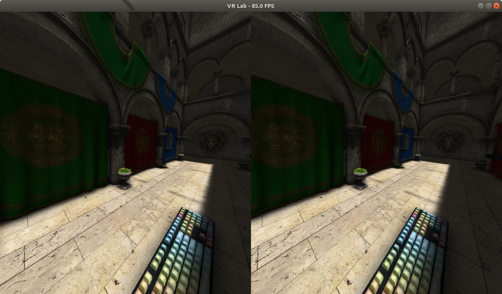
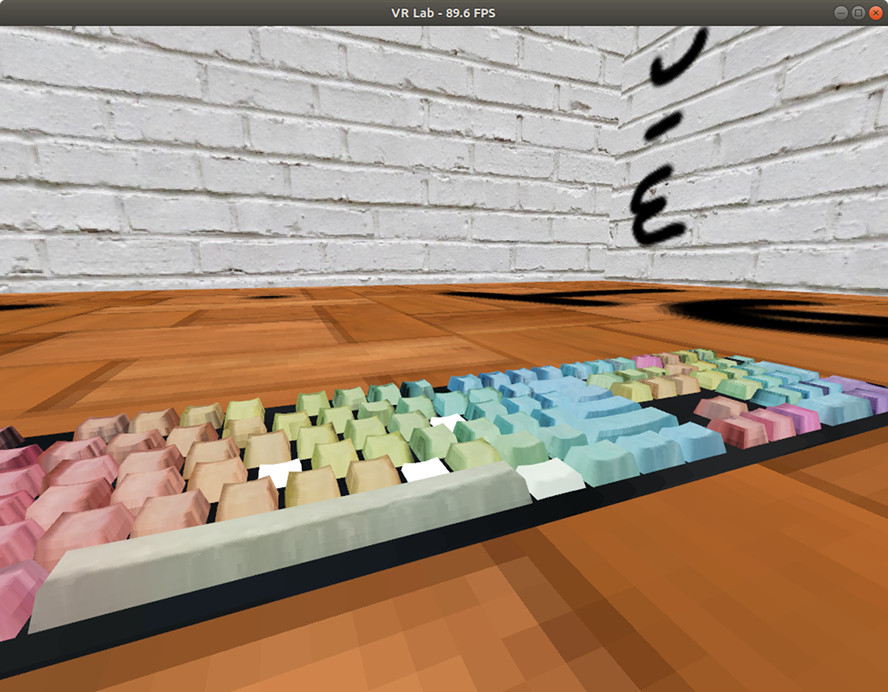
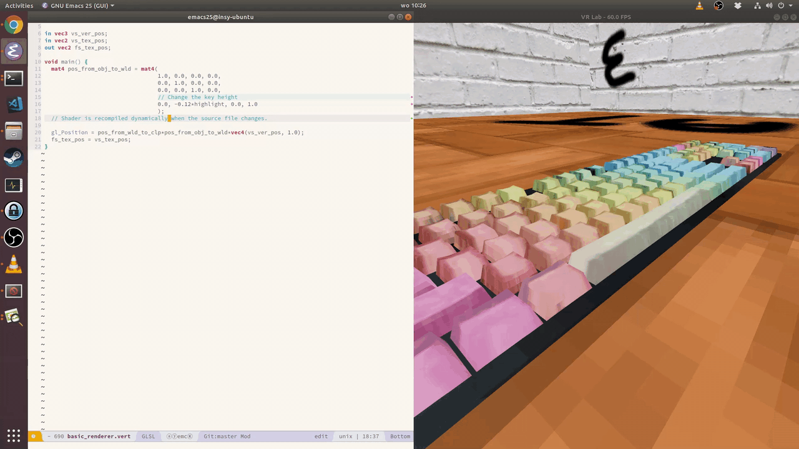
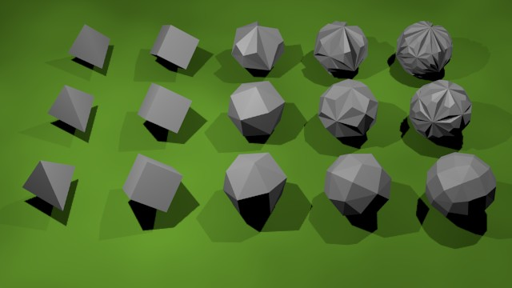
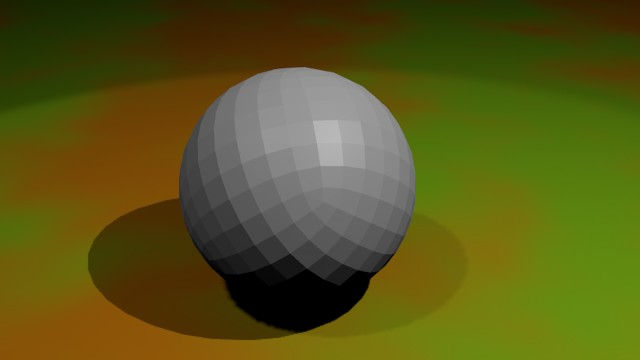
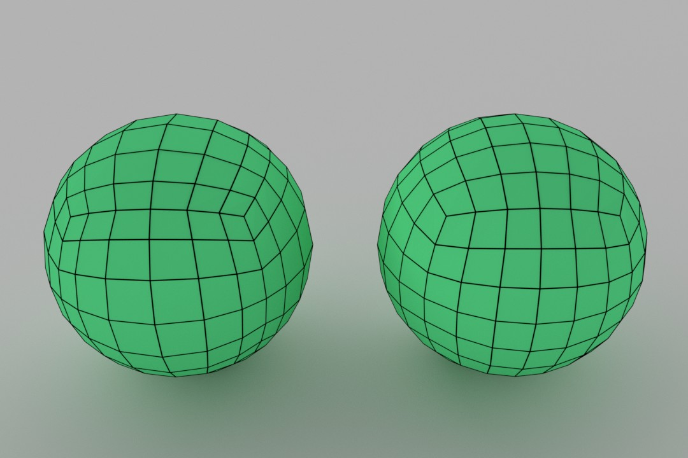
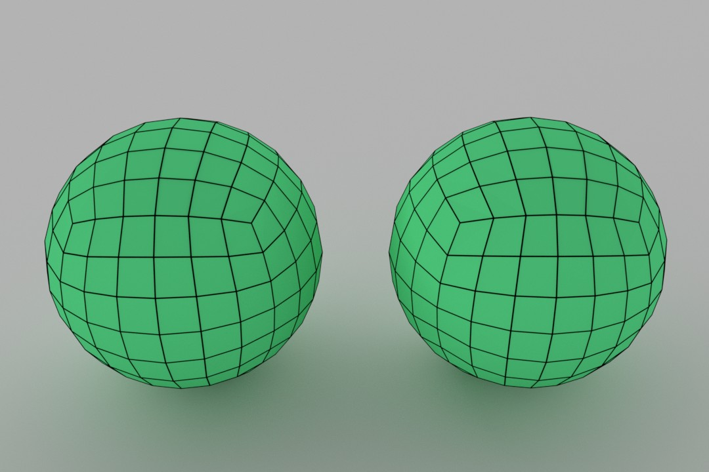

Requires SteamVR (installed through steam) and standard OpenGL development
headers and libraries to be installed.

Requires rust (nightly probably)

Probably only works on unixies.

Run with steam-runtime, for example:

```
~/.steam/steam/ubuntu12_32/steam-runtime/run.sh lldb target/debug/vr-lab
```

Disable vsync in the driver if you're using vr. This prevents the buffer swap
from blocking and thus render at your display's frequency which is probably 60Hz
while we need to render to the HDM at 90Hz.

## Dependencies

### CMake

```
sudo apt install cmake
sudo apt install clang-8
```

### Steam needs QT5.

Also OpenGL development headers are always nice to have.

`sudo apt install qtbase5-dev mesa-common-dev libqt5multimedia5`

## Troubleshooting

1. If SteamVR is running and *then* you plug in the HMD, it will not work, at
   least on Linux by Jan 2019. Kill the SteamVR processes and start the
   application.

2. If SteamVR is not running and you start the application, it might give up
   before SteamVR has completely launched and exit. Starting the application
   again might make things work because SteamVR had time to launch.
   
3. If you're using a single base-station, make sure it is configured as type A.

4. If somethings up with the config path:
   https://github.com/ValveSoftware/SteamVR-for-Linux/issues/89

## Interesting stuff

Reducing render-to-photons latency: http://media.steampowered.com/apps/valve/2015/Alex_Vlachos_Advanced_VR_Rendering_GDC2015.pdf

### Demo as of orthogonal-and-perspective-clustering

<a href="http://www.youtube.com/watch?feature=player_embedded&v=d0YlHdBU79g
" target="_blank"></a>

### Scheduling simlution and rendering

Connection between some OpenVR calls and time.
https://github.com/ValveSoftware/openvr/issues/434

Information and methods on how why dropping frames is bad, how to minimize the
chance of dropping frames, and what options there are when you do drop a frame.
Has a focus on stereoscopic rendering but most ideas apply to monoscopic
rendering as well.
https://www.gdcvault.com/play/1023522/Advanced-VR-Rendering

Analyzing frame timing when using SteamVR.
https://developer.valvesoftware.com/wiki/SteamVR/Frame_Timing

TODO: Watch
https://www.gdcvault.com/play/1021771/Advanced-VR

## Media

### First working version

To celebrate the first working VR version of this project I modeled my keyboard.
The keys come from a single .obj file but are rendered separately. I had to map
each keyboard scancode to the name of each key. Then a virtual keyboard
simulates the key pressure which is transfered through a uniform and used to
translate the key and brighten its color.



### Hot reloading

I wanted my shaders to be recompiled while the application is running as soon as
their source files change. This lets me correct small mistakes in them very
quickly. The vertex layout and everything is static so there is only so much you
can do without recompiling. Pretty neat though.



### Sphere generation

So I wanted to render a sphere. Then I wanted to generate a sphere. I did not
understand why blender doesn't let me generate a sphere from its smallest
representation with a volume: the tetrahedron. Decided that it would be a good
idea to take a tetrahedron and divide each triangle into 3 new triangles joined
at the barycenter of the original vertices.

[Commit](https://github.com/mickvangelderen/vr-lab/commit/42118e32d058836fa58fdbd1224750c05514af20)

The top row in this image shows the results of that approach:



Obviously I had been naive. The triangles get thin and there are dents
everywhere. Perhaps if we join triangles that have the same normals into quads,
and then subdivide the quads instead we will get nice results. That technique
yields the middle row of spheres. It breaks down after a couple of subdivisions
and we're back at the start.

[Commit](https://github.com/mickvangelderen/vr-lab/commit/29f355ce63516bd215546d28169bb7d190399a0d)

We need a better method. After going through a number of criteria and
implementations I arrived at the following rule. For each pair of different
triangles, determine if they share an edge. If they share an edge, compute the
barycenter of each triangle, project it onto the sphere. I'll call and edge
between these projected barycenters the cross edge. Now determine if the center
of the cross edge is further away than that of the shared edge. If so, we would
benefit from merging the two triangles because it will prevent use from creating
dents.

However, there are too many candidates. So we only merge the two triangles who
have the largest difference between the cross edge center and the shared edge
center.

This method yields the spheres in the last row. It looks a lot like a cubic
subdivision projected on a sphere and it might be *exactly* that.

[Commit](https://github.com/mickvangelderen/vr-lab/commit/5051017792ff93a013b3e6a5510b5d9a96f16713)



#### Generating positions and faces without lookups

As it turns out, there exist only 5 shapes of which each face has the same shape
and the normal of each face intersects with the center. This makes me happy
because that means there are only so many shapes you can reasonably generate a
sphere from through subdivision. These shapes are called the platonic solids.

In my previous sphere generation attempts I had to lookup if vertices already
existed. The subdivision also happened recursively so I could only create
subdivisions of powers of 2. I wanted to tackle both of these non-niceties. I
just needed to decide on which platonic solid to try it on. The tetrahedron is
the simplest one but it's vertices aren't nicely inline with an orthogonal 3D
basis. The cube is pretty simple.

It turns out that if you take a cube and subdivide it so that each edge has n +
2 vertices, you will have 8 corners, 12 * n vertices between the corners and 6 *
n ^ 2 verices on the faces between the edges. We can create an indexing scheme
for these three parts so we don't have to lookup vertices, we can simply find
its index by its 3D position.

The challenge in implementing all this was finding the right equations to
compute the vertices. You can do multiple things. The simplest one is generating
a subdivided cube, then taking each vertex and projecting it onto the sphere.
The resulting faces vary in size quite a bit. We would rather interpolate over
arc length instead of the edge length.

It turns out you can do this fairly easily. It took me a good two days to get to
the point where I understood exactly how. First I was looking into spherical
interpolation which didn't turn out to be that useful. Then I used polar
coordinates which kind of looked alright for a small number of subdivisions but
wasn't actually correct. 

Finally I got the equations right by finding the intersection of XZ rotated by
a, XY rotated by b, and a sphere with radius r. Here a and b are linearly
interpolated from -PI/4 to PI/4. In effect you perform two rotations on the unit
X vector but its nicer to find the direct equations for the resulting point.

The equation involves this term: sqrt(cos^2(a) * sin^2(b) + cos^2(b)). I failed
to simplify it and so did wolframalpha. I haven't spent a lot of time
understanding it geometrically but it corrects the magnitude of the
intersection. I find it interesting how it isn't symmetric, unlike the rest of
the equations.

Here is a comparison between the cube projected vertices and the spherical
vertices.



[Code](https://github.com/mickvangelderen/vr-lab/releases/tag/cubic-sphere-generation)

#### Jarring change in curvature of face vertices versus edge vertices

I noticed something was off that bothered me. If you look closely at the arcs
that the lines on the cube faces make, you'll notice that the vertices on the
edges aren't actually on the arc. I used to calculate the vertices by
interpolating over the angle between the triangle (center, corner 1, corner 2).
This angle theta can be computed easily by taking two corners as vectors:
cos(theta) = dot([1, 1, 1], [1, 1, -1]).

This yields a different result from the intersecting planes equation, fixing one
of the angles to PI/4 changes the sphere to look like the one on the right.



[Code](https://github.com/mickvangelderen/vr-lab/releases/tag/cubic-sphere-generation-fix-edge)

## A decent VR-ready renderer

We are rendering the sponza scene in realtime, in VR, with reasonable detail! 


There are some straightforward but probably time consuming improvments to be made:

1. Use bindless textures
2. Leverage multi draw commands.

Right now we're doing ~8000 OpenGL calls per frame. Most of them are setting
material related uniforms and actually doing the draws.

However this does not seem to be a bottle neck right now, as far as I can tell
from the apitrace and NSight anyway. The basic renderer and the ambient
occlusion renderer are taking up most of the frame budget. 

Theres also a lot of duplication in the code still, despite my efforts to reduce
it.

The statefulness of OpenGL makes me uneasy. It is probably a good idea to always set all of the rendering state, like framebuffers, color attachment locations, and write masks, before each renderer runs. Cach
better to live with non-significant overhead and cache the opengl state locally to 

### Future

Thing I would like to try:

1. bindless textures
2. multi-draw commands
3. exponential shadow maps

Things I need to do:

1. provide and shade with multiple point/spot lights
2. implement basic monoscopic clustered light shading
