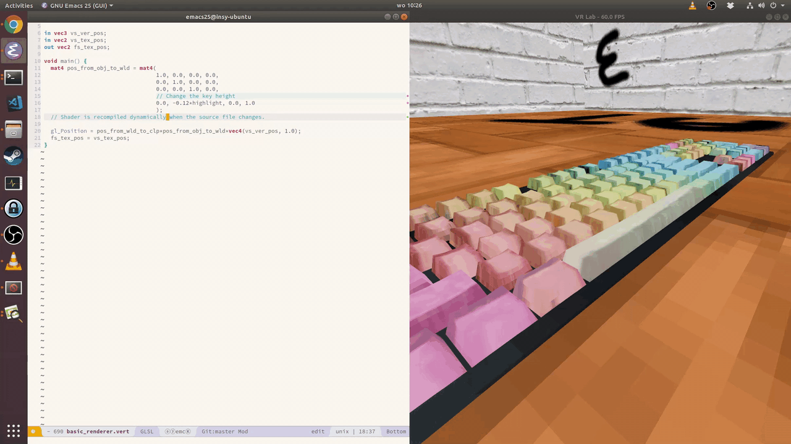
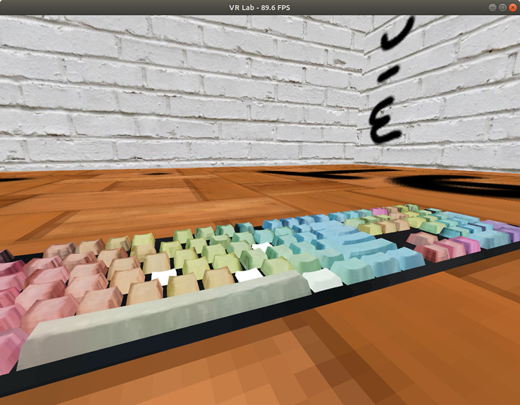

Requires SteamVR (installed through steam) and standard OpenGL development
headers and libraries to be installed.

Requires rust (nightly probably)

Probably only works on unixies.

Run with steam-runtime, for example:

```
~/.steam/steam/ubuntu12_32/steam-runtime/run.sh lldb target/debug/vr-lab
```

Disable vsync in the driver if you're using vr. This prevents the buffer swap
from blocking and thus render at your display's frequency which is probably 60Hz
while we need to render to the HDM at 90Hz.

## Dependencies

### Sibling repositories.

`git clone git@github.com:mickvangelderen/gl-typed-rust`
`git clone git@github.com:mickvangelderen/openvr-sys-rust --recursive`
`git clone git@github.com:mickvangelderen/openvr-rust`

### Steam needs QT5.

Also OpenGL development headers are always nice to have.

`sudo apt install qtbase5-dev mesa-common-dev libqt5multimedia5`

## Troubleshooting

1. If SteamVR is running and *then* you plug in the HMD, it will not work, at
   least on Linux by Jan 2019. Kill the SteamVR processes and start the
   application.

2. If SteamVR is not running and you start the application, it might give up
   before SteamVR has completely launched and exit. Starting the application
   again might make things work because SteamVR had time to launch.
   
3. If you're using a single base-station, make sure it is configured as type A.

4. If somethings up with the config path:
   https://github.com/ValveSoftware/SteamVR-for-Linux/issues/89

## Interesting stuff

Reducing render-to-photons latency: http://media.steampowered.com/apps/valve/2015/Alex_Vlachos_Advanced_VR_Rendering_GDC2015.pdf


### Scheduling simlution and rendering

Connection between some OpenVR calls and time.
https://github.com/ValveSoftware/openvr/issues/434

Information and methods on how why dropping frames is bad, how to minimize the
chance of dropping frames, and what options there are when you do drop a frame.
Has a focus on stereoscopic rendering but most ideas apply to monoscopic
rendering as well.
https://www.gdcvault.com/play/1023522/Advanced-VR-Rendering

Analyzing frame timing when using SteamVR.
https://developer.valvesoftware.com/wiki/SteamVR/Frame_Timing

TODO: Watch
https://www.gdcvault.com/play/1021771/Advanced-VR

## Media

### First working version

To celebrate the first working VR version of this project I modeled my keyboard.
The keys come from a single .obj file but are rendered separately. I had to map
each keyboard scancode to the name of each key. Then a virtual keyboard
simulates the key pressure which is transfered through a uniform and used to
translate the key and brighten its color.



### Hot reloading

I wanted my shaders to be recompiled while the application is running as soon as
their source files change. This lets me correct small mistakes in them very
quickly. The vertex layout and everything is static so there is only so much you
can do without recompiling. Pretty neat though.


### Sphere generation

So I wanted to render a sphere. Then I wanted to generate a sphere. I did not
understand why blender doesn't let me generate a sphere from its smallest
representation with a volume: the tetrahedron. Decided that it would be a good
idea to take a tetrahedron and divide each triangle into 3 new triangles joined
at the barycenter of the original vertices.

[Commit](https://github.com/mickvangelderen/vr-lab/commit/42118e32d058836fa58fdbd1224750c05514af20)

The top row in this image shows the results of that approach:


Obviously I had been naive. The triangles get thin and there are dents
everywhere. Perhaps if we join triangles that have the same normals into quads,
and then subdivide the quads instead we will get nice results. That technique
yields the middle row of spheres. It breaks down after a couple of subdivisions
and we're back at the start.

[Commit](https://github.com/mickvangelderen/vr-lab/commit/29f355ce63516bd215546d28169bb7d190399a0d)

We need a better method. After going through a number of criteria and
implementations I arrived at the following rule. For each pair of different
triangles, determine if they share an edge. If they share an edge, compute the
barycenter of each triangle, project it onto the sphere. I'll call and edge
between these projected barycenters the cross edge. Now determine if the center
of the cross edge is further away than that of the shared edge. If so, we would
benefit from merging the two triangles because it will prevent use from creating
dents.

However, there are too many candidates. So we only merge the two triangles who
have the largest difference between the cross edge center and the shared edge
center.

This method yields the spheres in the last row. It looks a lot like a cubic
subdivision projected on a sphere and it might be *exactly* that.

[Commit](https://github.com/mickvangelderen/vr-lab/commit/5051017792ff93a013b3e6a5510b5d9a96f16713)


